# Retail Purchase Insights

## Customer Behavior, Revenue & Subscription Analytics

An end-to-end data analytics project analyzing retail customer purchasing behavior, revenue performance, customer segmentation, product performance, discounts, shipping preferences, and subscription behavior.

The project demonstrates a complete analytics workflow using **Python, Pandas, PostgreSQL, SQL, and Matplotlib/Seaborn**, transforming raw customer transaction data into structured analysis, business insights, and visualizations.

---

## Project Overview

The objective of this project is to analyze customer purchase behavior and identify patterns that can support business decisions related to:

- Revenue performance
- Customer segmentation
- Subscription behavior
- Product and category performance
- Customer purchasing frequency
- Discounts and promotions
- Shipping preferences
- Customer ratings
- Demographic purchasing patterns
- Customer retention and engagement

The project follows an end-to-end analytical workflow:

**Raw Data → Data Cleaning & Preparation → PostgreSQL → SQL Analysis → Business Insights → Python (Matplotlib/Seaborn) Visualization**

---

## Key Project Highlights

- Analyzed **3,900 customer transaction records** across **18 attributes**.
- Identified **$233K in total purchase revenue** within the dataset.
- Clothing generated approximately **$104.3K (~44.7%)** of recorded revenue.
- Male customers accounted for approximately **$157.9K (~67.7%)** of recorded revenue.
- Segmented customers into **New, Returning, and Loyal** groups using previous-purchase behavior.
- Identified **3,116 Loyal, 701 Returning, and 83 New customers**.
- Compared subscriber and non-subscriber customer behavior using customer count, average spend, and total revenue.
- Analyzed the relationship between discounts, shipping types, product ratings, purchasing behavior, and subscription status.
- Built Matplotlib/Seaborn visualizations to communicate customer segmentation and subscription insights.

---

## Data Analytics Workflow

### 1. Data Exploration & Profiling

The raw retail customer dataset was first explored using Python and Pandas to understand:

- Dataset structure
- Number of records and attributes
- Data types
- Missing values
- Duplicate or redundant fields
- Customer and transaction attributes
- Revenue-related variables
- Categorical distributions

The dataset contained **3,900 records and 18 attributes**.

---

### 2. Data Cleaning & Preparation

Python/Pandas was used to prepare the dataset for downstream SQL analysis.

Key preparation activities included:

- Profiling the dataset for data-quality issues.
- Identifying **37 missing review-rating values**.
- Imputing missing review ratings using **category-level medians**.
- Standardizing column names for consistent querying.
- Engineering customer **age-group** classifications.
- Creating purchase-frequency related features.
- Validating and removing a redundant field containing duplicate information.
- Preparing the cleaned dataset for relational database analysis.

---

### 3. PostgreSQL Database

The prepared dataset was loaded into a PostgreSQL database named:

`customer_behavior`

PostgreSQL was used as the relational database layer for structured querying and analytical analysis.

Python connectivity was handled using:

- **SQLAlchemy**
- **psycopg2**

Database credentials and connection details are kept outside the public repository.

---

### 4. SQL Business Analysis

SQL was used to answer **10 business questions** covering customer behavior, revenue, products, subscriptions, discounts, shipping, ratings, and customer segmentation.

Analytical SQL techniques included:

- Filtering
- Aggregations
- `GROUP BY`
- `CASE`
- Joins
- Subqueries
- Common Table Expressions (CTEs)
- Window functions
- Ranking
- Conditional calculations

The objective was to transform relational customer data into structured analytical outputs that could support business decision-making.

---

## Key Business Insights

### Revenue Performance

Total recorded purchase revenue in the dataset was approximately:

**$233K**

Clothing was the largest revenue-contributing category, generating approximately:

**$104.3K (~44.7%)**

Male customers represented approximately:

**$157.9K (~67.7%)**

of recorded revenue.

---

### Customer Segmentation

Customers were segmented based on previous-purchase behavior:

| Customer Segment | Customers |
|---|---:|
| Loyal | 3,116 |
| Returning | 701 |
| New | 83 |

This segmentation provides a foundation for evaluating:

- Customer retention
- Repeat purchasing
- Engagement strategies
- Subscription opportunities
- Customer lifetime value

---

### Subscription Analysis

Customer subscription behavior was analyzed by comparing subscriber and non-subscriber groups across:

- Customer count
- Average purchase amount
- Total revenue
- Purchasing behavior

A **Subscription Status** donut chart shows a:

**73% vs 27% distribution**

between non-subscribers and subscribers (see [Visualizations](#visualizations) below).

---

## Visualizations

Charts answering each of the 10 SQL business questions (plus two summary views) were generated with **Matplotlib/Seaborn** via [`generate_visuals.py`](generate_visuals.py) and exported to [`visuals/`](visuals/).

| | |
|---|---|
| 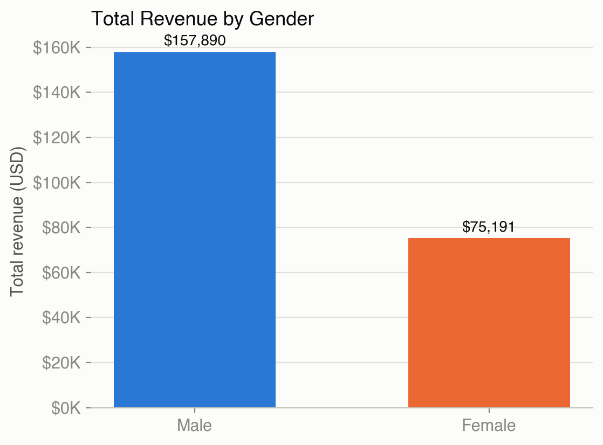 | 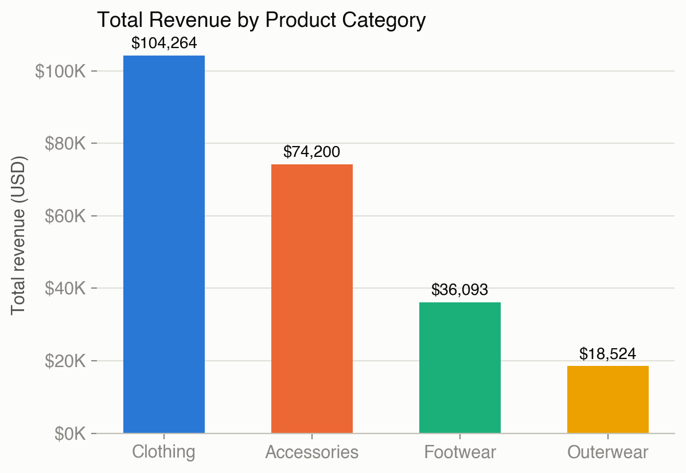 |
| 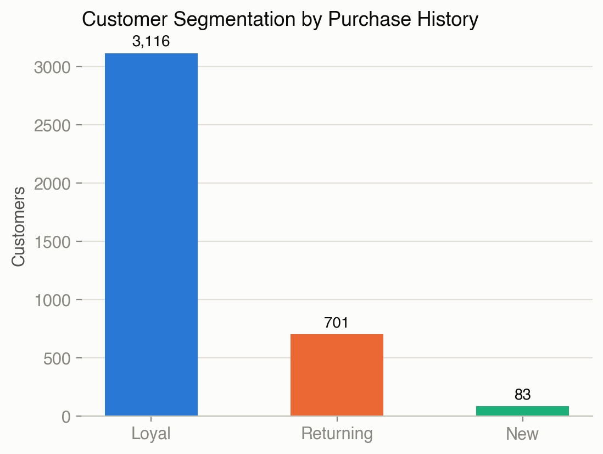 | 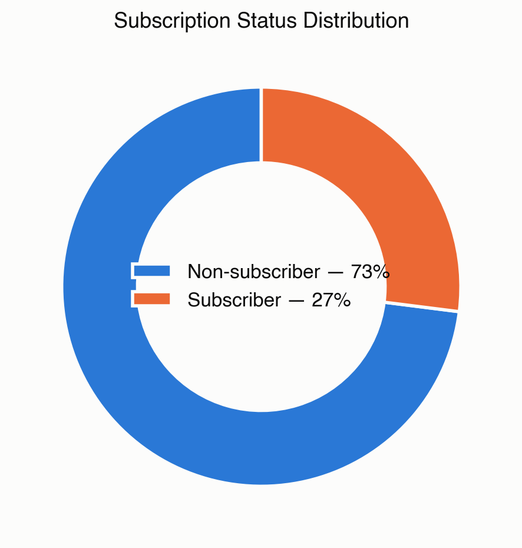 |
| 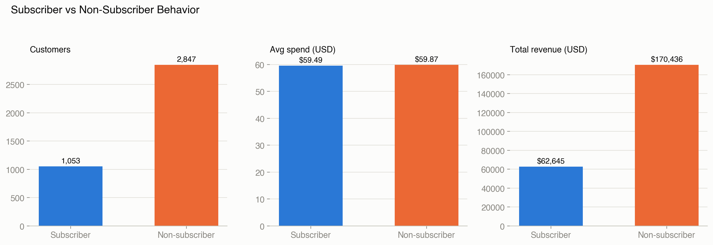 | 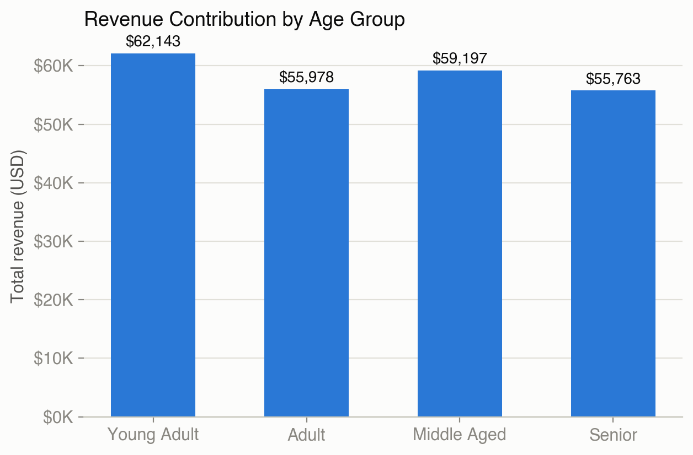 |
| 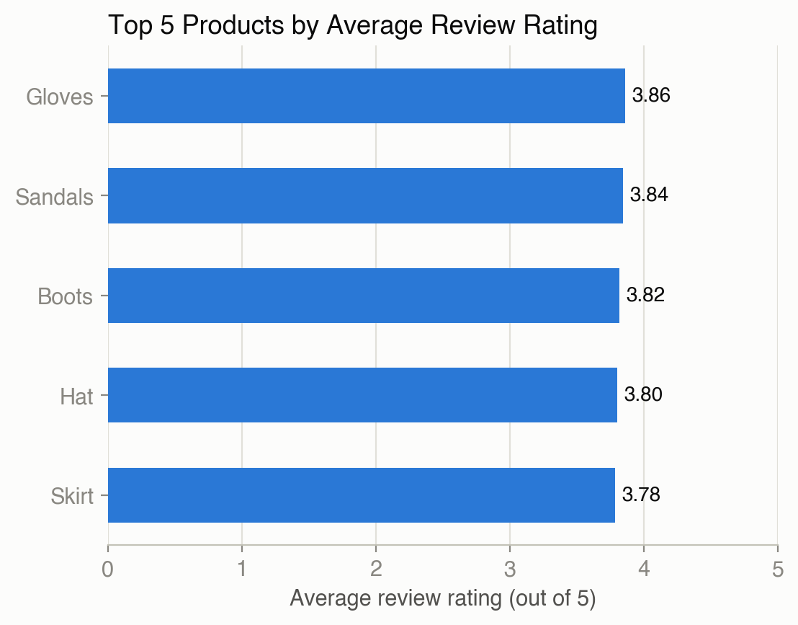 | 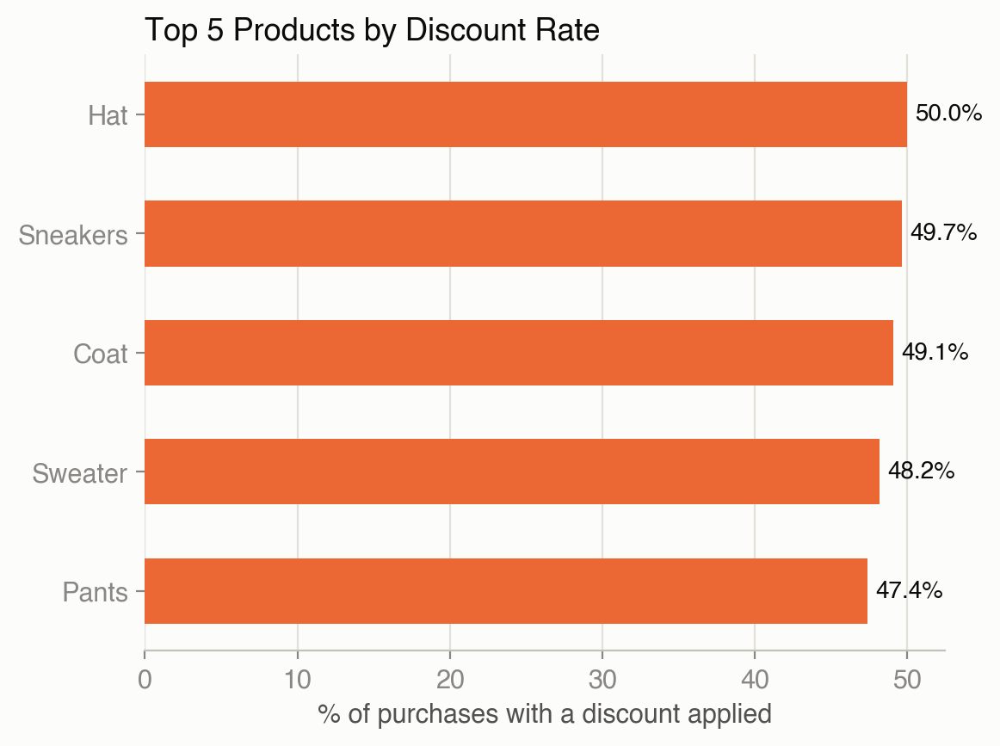 |
| 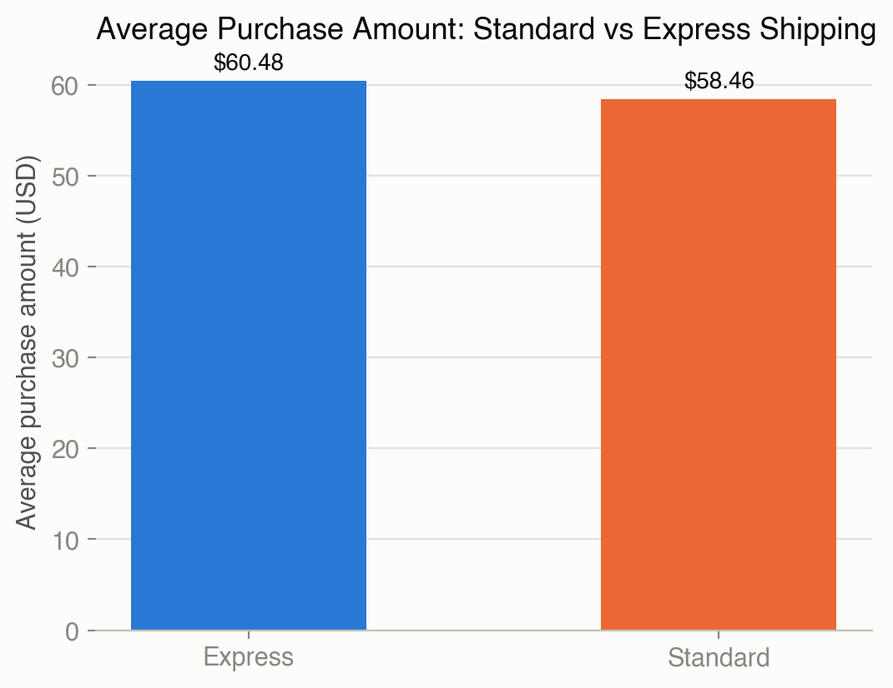 | 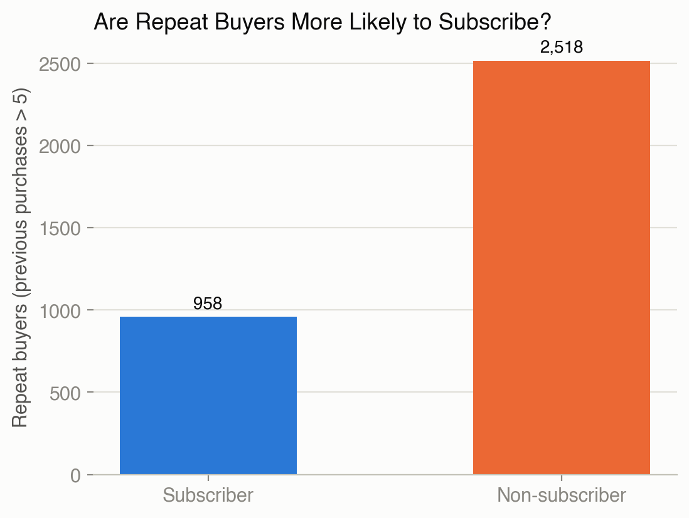 |
| 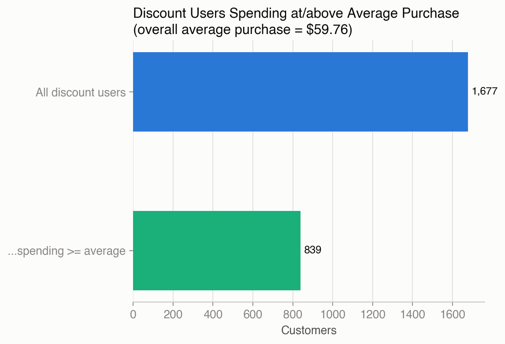 | 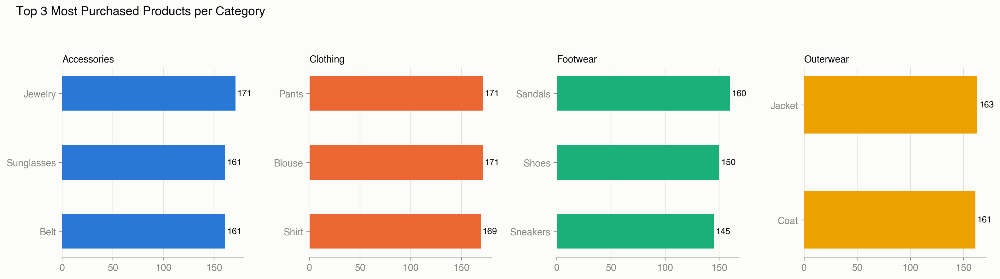 |

To regenerate the charts from the raw CSV:

```bash
pip install pandas matplotlib seaborn
python3 generate_visuals.py
```

---

## Technology Stack

### Programming & Data Analysis

- Python
- Pandas

### Database & SQL

- PostgreSQL
- SQL
- SQLAlchemy
- psycopg2

### Data Visualization

- Matplotlib
- Seaborn

### Development Environment

- Google Colab
- VS Code
- PostgreSQL

---

## Project Structure

```text
retail-purchase-insights/
│
├── customer_shopping_behavior.csv     Raw dataset
├── Retail_Purchase_insight.ipynb      Data cleaning & preparation (Python/Pandas)
├── customer_behavior:PostgreSQL.sql   PostgreSQL business-question queries
├── generate_visuals.py                Matplotlib/Seaborn chart generation
├── visuals/                           Generated PNG chart exports
└── README.md
